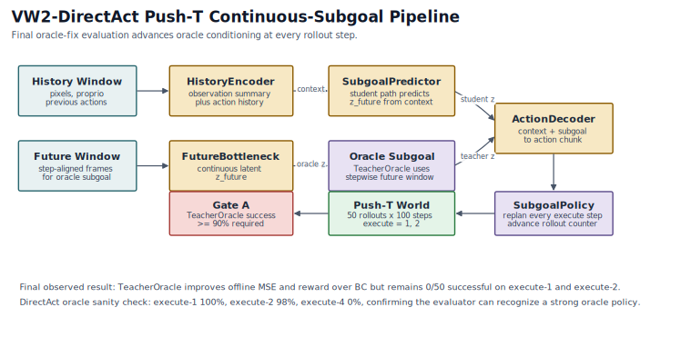
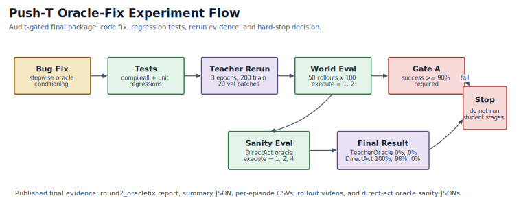
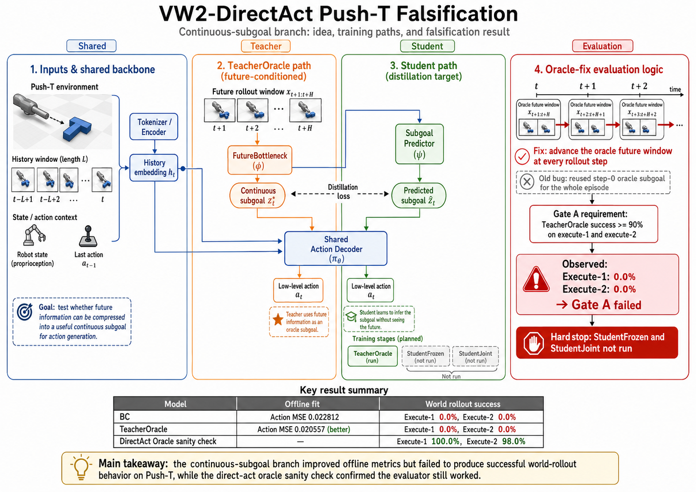

# VW2-DirectAct Push-T Falsification

This repository packages the final Push-T-focused VW2-DirectAct falsification record for public review. It includes the training and evaluation code, the continuous-subgoal distillation branch, and the validated `round2_oraclefix` artifacts produced after fixing the rollout-side oracle-conditioning bug.

The final result is negative and explicit: after the oracle-fix rerun, TeacherOracle still failed Gate A with 0.0% world success on execute-1 and execute-2. The future-conditioned Push-T branch was stopped without running StudentFrozen or StudentJoint.

## Highlights

- Push-T-first VW2-DirectAct codebase with tokenizer, planner, action decoder, and continuous-subgoal distillation stages
- Stepwise oracle-conditioning fix in both direct-act and subgoal rollout policies
- Regression tests for stepwise oracle plan and subgoal selection
- Final public artifacts for `round2_oraclefix`: report, summary JSON, per-episode CSVs, rollout videos, TeacherOracle logs, and direct-act oracle sanity-check JSONs

## Model Pipeline



More detail: [docs/architecture.md](docs/architecture.md).

## Experiment Flow



## Overview Illustration



This user-provided ChatGPT-generated overview is included as an illustrative overview only. Treat the committed JSON, CSV, source code, and report artifacts as the evidence backing the metrics and verdict.

## Repository Layout

```text
.
├─ vw2_directact/
│  ├─ configs/
│  ├─ data/
│  ├─ models/
│  ├─ train/
│  ├─ utils/
│  ├─ tests/
│  └─ scripts/
├─ docs/
│  └─ figures/
└─ artifacts/
   └─ pusht_subgoal_distill_round2_oraclefix/
      ├─ subgoal_distill_round2_oraclefix_report.tex
      ├─ subgoal_distill_round2_oraclefix_report.pdf
      ├─ eval_50rollouts_100steps/
      ├─ eval_subgoal_50rollouts_100steps/
      ├─ directact_oracle_eval_50rollouts_100steps/
      └─ teacher_oracle/
```

## Installation

Use Python 3.11.

```powershell
python -m venv .venv
.venv\Scripts\activate
pip install -r requirements.txt
```

`stable_worldmodel` is required for Push-T world rollouts and real HDF5 loading. It is not bundled in this repository. Install it from your local checkout or internal package source so that `import stable_worldmodel` works.

## Data Preparation

Use either an explicit HDF5 path or `STABLEWM_HOME`:

```powershell
$env:STABLEWM_HOME = "C:\Users\yiche\.stable-wm"
```

The loader resolves the dataset in this order:

1. `data.path=/absolute/path/to/pusht_expert_train.h5`
2. `$STABLEWM_HOME/pusht_expert_train.h5`
3. `~/.stable-wm/pusht_expert_train.h5`

## Final Rerun Commands

The final world-evaluation commands used `eval.rollout_batch_size=10` for stable local RTX 4070 8 GB evaluation. This changes batching only, not evaluation semantics.

Train the TeacherOracle subgoal branch:

```powershell
python -m vw2_directact.train.train_teacher_oracle --config-name pusht `
  experiment_name=pusht_subgoal_distill_round2_oraclefix `
  train.init_from=/path/to/pusht_falsification_oracle/action/last.ckpt
```

Evaluate BC and TeacherOracle with 50 rollouts and 100 steps:

```powershell
python -m vw2_directact.train.eval_subgoal_policy --config-name pusht `
  --bc-checkpoint /path/to/pusht_falsification_bc/action/last.ckpt `
  --teacher-checkpoint ./vw2_directact_outputs/pusht_subgoal_distill_round2_oraclefix/teacher_oracle/last.ckpt `
  experiment_name=pusht_subgoal_distill_round2_oraclefix `
  eval.rollout_batch_size=10 `
  eval.num_rollouts=50 `
  eval.max_steps=100
```

Run the direct-act oracle evaluator sanity check:

```powershell
python -m vw2_directact.train.eval_policy --config-name pusht `
  --checkpoint /path/to/pusht_falsification_oracle/action/last.ckpt `
  experiment_name=pusht_falsification_oracle `
  conditioning.mode=oracle `
  ablation.mode=full `
  model.use_vq=true `
  eval.rollout_batch_size=10 `
  eval.num_rollouts=50 `
  eval.max_steps=100
```

The older `vw2_directact/scripts/run_falsification_round.py` is retained as a legacy sweep helper. The public final result is the oracle-fix rerun above.

## Evaluation Scope

The world rollouts are deterministic starts from `pusht_expert_train.h5`, selected by the evaluator from valid expert episodes. They are not an episode-held-out test split. For the final artifacts, BC and the direct-act oracle sanity check use the direct-act evaluator starts: episodes 0-49 at `start_step=0`. TeacherOracle uses the subgoal evaluator starts: episodes 101-150 at `start_step=3`. The train/validation loaders split sampled windows, so offline validation metrics should not be read as episode-level generalization metrics.

This scope does not weaken the Gate A verdict: TeacherOracle fails with 0.0% success even on these in-dataset deterministic world rollouts.

## Final Results From `round2_oraclefix`

| Model | Offline Action MSE | Execute-1 Success | Execute-2 Success | Execute-1 Mean Reward | Execute-2 Mean Reward |
| --- | ---: | ---: | ---: | ---: | ---: |
| BC | 0.022812 | 0.0% | 0.0% | -23644.98 | -24199.06 |
| TeacherOracle | 0.020557 | 0.0% | 0.0% | -21435.20 | -20406.16 |

TeacherOracle improves offline MSE and mean reward over BC, but it still achieves zero successes in all 100 evaluated world rollouts. That is a direct Gate A failure.

## Evaluator Sanity Check

The same fixed evaluator was rerun on the direct-act oracle action model.

| Model | Execute-1 Success | Execute-2 Success | Execute-4 Success |
| --- | ---: | ---: | ---: |
| DirectAct Oracle | 100.0% | 98.0% | 0.0% |

This separates evaluator correctness from the subgoal-branch failure. The evaluator still supports a strong oracle policy on Push-T after the fix.

## Gate Summary

- Gate A: failed. TeacherOracle needed at least 90% success on execute-1 and execute-2. It reached 0.0% on both in the oracle-fix rerun.
- Gate B: not run because the branch hard-stopped at Gate A.
- Gate C: not run because the branch hard-stopped at Gate A.
- Gate D: not run because the branch hard-stopped at Gate A.

## Published Artifacts

- Final report source: `artifacts/pusht_subgoal_distill_round2_oraclefix/subgoal_distill_round2_oraclefix_report.tex`
- Final report PDF: `artifacts/pusht_subgoal_distill_round2_oraclefix/subgoal_distill_round2_oraclefix_report.pdf`
- Evaluation summary: `artifacts/pusht_subgoal_distill_round2_oraclefix/eval_subgoal_50rollouts_100steps/summary.json`
- Per-episode CSVs: `artifacts/pusht_subgoal_distill_round2_oraclefix/eval_subgoal_50rollouts_100steps/`
- Rollout videos: `artifacts/pusht_subgoal_distill_round2_oraclefix/eval_50rollouts_100steps/` and `artifacts/pusht_subgoal_distill_round2_oraclefix/eval_subgoal_50rollouts_100steps/TeacherOracle/videos_execute_1/`
- Direct-act oracle sanity-check JSONs: `artifacts/pusht_subgoal_distill_round2_oraclefix/directact_oracle_eval_50rollouts_100steps/`
- Teacher training logs: `artifacts/pusht_subgoal_distill_round2_oraclefix/teacher_oracle/`

## Validation

The packaged code should validate with:

```powershell
python -B -m compileall -q vw2_directact
python -B -m unittest discover -s vw2_directact\tests -v
git diff --check
```

World-evaluation code now raises a hard error when `eval.run_world=true` but `stable_worldmodel`, the Push-T HDF5 dataset, or valid rollout starts are unavailable.

## Notes

- Checkpoints are intentionally excluded from version control.
- Raw datasets and local caches are excluded from version control.
- The repository contains the final evidence needed to justify stopping this Push-T branch on Push-T.

## License

MIT
