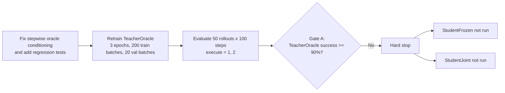

# VW2-DirectAct Push-T Falsification

This repository packages the final Push-T-focused VW2-DirectAct falsification record for public review. It includes the training and evaluation code, the continuous-subgoal distillation branch, the archived `round1` artifacts, and the final `round2_oraclefix` rerun after the rollout-side oracle-conditioning bug was fixed.

The final result is negative and explicit: after the oracle-fix rerun, TeacherOracle still failed Gate A with 0.0% world success on execute-1 and execute-2, so the future-conditioned Push-T branch was stopped without running StudentFrozen or StudentJoint.

## Highlights

- Push-T-first VW2-DirectAct codebase with tokenizer, planner, action decoder, and continuous-subgoal distillation stages
- Final evaluator fix for stepwise oracle conditioning in both direct-act and subgoal rollout policies
- Regression tests that verify oracle plan and oracle subgoal conditioning advance with rollout step
- Final public artifacts for the oracle-fix rerun: LaTeX report, summary JSON, per-episode CSVs, rollout videos, and direct-act oracle sanity-check JSONs

## Visual Summary



## Repository Layout

```text
.
├─ vw2_directact/
│  ├─ configs/
│  ├─ data/
│  ├─ models/
│  ├─ train/
│  ├─ utils/
│  ├─ tests/
│  └─ scripts/
└─ artifacts/
   ├─ pusht_subgoal_distill_round1/
   └─ pusht_subgoal_distill_round2_oraclefix/
      ├─ subgoal_distill_round2_oraclefix_report.tex
      ├─ subgoal_distill_round2_oraclefix_report.pdf
      ├─ eval_50rollouts_100steps/
      ├─ eval_subgoal_50rollouts_100steps/
      ├─ directact_oracle_eval_50rollouts_100steps/
      └─ teacher_oracle/
```

## Installation

Use Python 3.11 or newer.

```powershell
python -m venv .venv
.venv\Scripts\activate
pip install -r requirements.txt
```

`stable_worldmodel` is required for Push-T world rollouts and real HDF5 loading. It is not bundled in this repository. Install it from your local checkout or your internal package source so that `import stable_worldmodel` works.

## Data Preparation

You have two supported ways to point the code at Push-T:

1. Set `data.path=/absolute/path/to/pusht_expert_train.h5`
2. Or set `STABLEWM_HOME` so the loader can resolve `pusht_expert_train.h5` under `$STABLEWM_HOME`

If neither is provided, the code falls back to `~/.stable-wm/pusht_expert_train.h5`.

## Usage

Train the TeacherOracle subgoal branch:

```powershell
python -m vw2_directact.train.train_teacher_oracle --config-name pusht experiment_name=pusht_subgoal_distill_round1
```

Evaluate BC and TeacherOracle with 50 rollouts and 100 steps:

```powershell
python -m vw2_directact.train.eval_subgoal_policy `
  --config-name pusht `
  --bc-checkpoint ./path/to/bc.ckpt `
  --teacher-checkpoint ./path/to/teacher_oracle.ckpt
```

On 8 GB GPUs, the packaged config uses `eval.rollout_batch_size=10` for evaluation stability.

Run planner diagnostics for the VQ planner branch:

```powershell
python -m vw2_directact.train.diagnose_planner --config-name pusht --checkpoint ./path/to/planner_or_joint.ckpt
```

Run the earlier falsification sweep script:

```powershell
python .\vw2_directact\scripts\run_falsification_round.py
```

## Final Results From `round2_oraclefix`

| Model | Offline Action MSE | Execute-1 Success | Execute-2 Success | Execute-1 Mean Reward | Execute-2 Mean Reward |
| --- | ---: | ---: | ---: | ---: | ---: |
| BC | 0.022812 | 0.0% | 0.0% | -23644.98 | -24199.06 |
| TeacherOracle | 0.020557 | 0.0% | 0.0% | -21435.20 | -20406.16 |

TeacherOracle improves offline MSE and mean reward over BC, but it still achieves zero successes in all 100 evaluated world rollouts. That is a direct Gate A failure.

## Evaluator Sanity Check After The Fix

The same fixed evaluator was rerun on the existing direct-act oracle action model:

| Model | Execute-1 Success | Execute-2 Success | Execute-4 Success |
| --- | ---: | ---: | ---: |
| DirectAct Oracle | 100.0% | 98.0% | 0.0% |

This separates evaluator correctness from subgoal-branch failure. The evaluator still supports a strong oracle policy on Push-T after the fix.

## Gate Summary

- Gate A: failed. TeacherOracle needed at least 90% success on execute-1 and execute-2. It reached 0.0% on both in the oracle-fix rerun.
- Gate B: not run because the branch hard-stopped at Gate A.
- Gate C: not run because the branch hard-stopped at Gate A.
- Gate D: not run because the branch hard-stopped at Gate A.

## Published Artifacts

- Final rerun report source: `artifacts/pusht_subgoal_distill_round2_oraclefix/subgoal_distill_round2_oraclefix_report.tex`
- Final rerun report PDF: `artifacts/pusht_subgoal_distill_round2_oraclefix/subgoal_distill_round2_oraclefix_report.pdf`
- Final rerun evaluation summary: `artifacts/pusht_subgoal_distill_round2_oraclefix/eval_subgoal_50rollouts_100steps/summary.json`
- Final rerun per-episode CSVs: `artifacts/pusht_subgoal_distill_round2_oraclefix/eval_subgoal_50rollouts_100steps/`
- Final rerun rollout videos: `artifacts/pusht_subgoal_distill_round2_oraclefix/eval_50rollouts_100steps/` and `artifacts/pusht_subgoal_distill_round2_oraclefix/eval_subgoal_50rollouts_100steps/TeacherOracle/videos_execute_1/`
- Direct-act oracle sanity-check JSONs: `artifacts/pusht_subgoal_distill_round2_oraclefix/directact_oracle_eval_50rollouts_100steps/`
- Teacher training logs: `artifacts/pusht_subgoal_distill_round2_oraclefix/teacher_oracle/`
- Archived first-pass artifacts remain in `artifacts/pusht_subgoal_distill_round1/`

## Validation

The packaged code was validated with:

```powershell
python -m compileall vw2_directact
python -m unittest discover -s vw2_directact\tests -v
```

## Notes

- Checkpoints are intentionally excluded from version control.
- The repository contains the finished evidence needed to justify stopping this Push-T branch on Push-T.
- The included `round2_oraclefix` LaTeX report is the authoritative write-up of the final rerun.

## License

MIT
