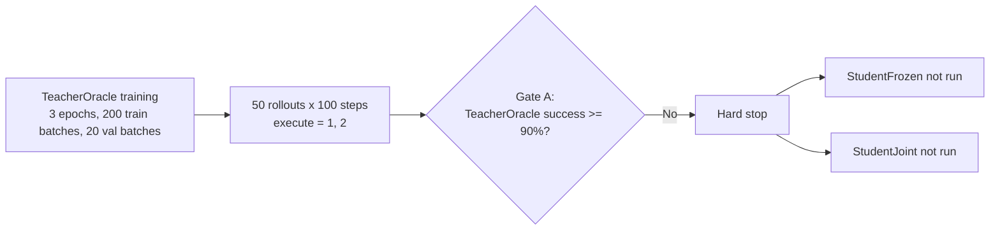

# VW2-DirectAct Push-T Falsification

This repository packages a Push-T-focused VW2-DirectAct experiment for public review. It includes the training and evaluation code, the continuous-subgoal distillation implementation, and the finished falsification artifacts from the `vw2_subgoal_distill` round.

The finished result is negative and explicit: the continuous-subgoal TeacherOracle failed Gate A, so the future-conditioned Push-T branch was stopped without running StudentFrozen or StudentJoint.

## Highlights

- Push-T-first VW2-DirectAct codebase with tokenizer, planner, action decoder, and joint training stages
- Continuous subgoal branch with `HistoryEncoder`, `FutureBottleneck`, `SubgoalPredictor`, and `VW2SubgoalSystem`
- Planner diagnostics for entropy, perplexity, top-1 token ratio, unique token count, and conditioning ablations
- 50-rollout evaluation for 100-step episodes with execute-actions-per-plan sweeps
- Published artifacts for the completed subgoal-distillation round: report, summary JSON, per-episode CSVs, and rollout videos

## Visual Summary



## Repository Layout

```text
.
├─ vw2_directact/
│  ├─ configs/
│  ├─ data/
│  ├─ models/
│  ├─ train/
│  ├─ utils/
│  ├─ tests/
│  └─ scripts/
└─ artifacts/
   └─ pusht_subgoal_distill_round1/
      ├─ subgoal_distill_report.tex
      ├─ subgoal_distill_report.pdf
      ├─ eval_50rollouts_100steps/
      ├─ eval_subgoal_50rollouts_100steps/
      └─ teacher_oracle/
```

## Installation

Use Python 3.11 or newer.

```powershell
python -m venv .venv
.venv\Scripts\activate
pip install -r requirements.txt
```

`stable_worldmodel` is required for Push-T world rollouts and real HDF5 loading. It is not bundled in this repository. Install it from your local checkout or your internal package source so that `import stable_worldmodel` works.

## Data Preparation

You have two supported ways to point the code at Push-T:

1. Set `data.path=/absolute/path/to/pusht_expert_train.h5`
2. Or set `STABLEWM_HOME` so the loader can resolve `pusht_expert_train.h5` under `$STABLEWM_HOME`

If neither is provided, the code falls back to `~/.stable-wm/pusht_expert_train.h5`.

## Usage

Train the TeacherOracle subgoal branch:

```powershell
python -m vw2_directact.train.train_teacher_oracle --config-name pusht experiment_name=pusht_subgoal_distill_round1
```

Evaluate BC and TeacherOracle with 50 rollouts and 100 steps:

```powershell
python -m vw2_directact.train.eval_subgoal_policy `
  --config-name pusht `
  --bc-checkpoint ./path/to/bc.ckpt `
  --teacher-checkpoint ./path/to/teacher_oracle.ckpt
```

Run planner diagnostics for the VQ planner branch:

```powershell
python -m vw2_directact.train.diagnose_planner --config-name pusht --checkpoint ./path/to/planner_or_joint.ckpt
```

Run the earlier falsification sweep script:

```powershell
python .\vw2_directact\scripts\run_falsification_round.py
```

## Results From The Finished Subgoal-Distillation Round

| Model | Offline Action MSE | Execute-1 Success | Execute-2 Success | Execute-1 Mean Reward | Execute-2 Mean Reward |
| --- | ---: | ---: | ---: | ---: | ---: |
| BC | 0.022812 | 0.0% | 0.0% | -23644.90 | -24199.08 |
| TeacherOracle | 0.021369 | 0.0% | 0.0% | -48110.09 | -36832.53 |

## Gate Summary

- Gate A: failed. TeacherOracle needed at least 90% success on execute-1 and execute-2. It reached 0.0% on both.
- Gate B: not run because the branch hard-stopped at Gate A.
- Gate C: not run because the branch hard-stopped at Gate A.
- Gate D: not run because the branch hard-stopped at Gate A.

## Published Artifacts

- Report source: `artifacts/pusht_subgoal_distill_round1/subgoal_distill_report.tex`
- Report PDF: `artifacts/pusht_subgoal_distill_round1/subgoal_distill_report.pdf`
- Evaluation summary: `artifacts/pusht_subgoal_distill_round1/eval_subgoal_50rollouts_100steps/summary.json`
- Per-episode CSVs: `artifacts/pusht_subgoal_distill_round1/eval_subgoal_50rollouts_100steps/`
- Rollout videos: `artifacts/pusht_subgoal_distill_round1/eval_50rollouts_100steps/` and `artifacts/pusht_subgoal_distill_round1/eval_subgoal_50rollouts_100steps/TeacherOracle/videos_execute_1/`
- Teacher training logs: `artifacts/pusht_subgoal_distill_round1/teacher_oracle/`

## Validation

The packaged code was validated with:

```powershell
python -m compileall vw2_directact
python -m unittest discover -s vw2_directact\tests -v
```

## Notes

- Checkpoints are intentionally excluded from version control.
- The repository contains the finished experimental evidence needed to justify stopping this Push-T branch.
- The included LaTeX report is the authoritative write-up of the completed run.

## License

MIT
